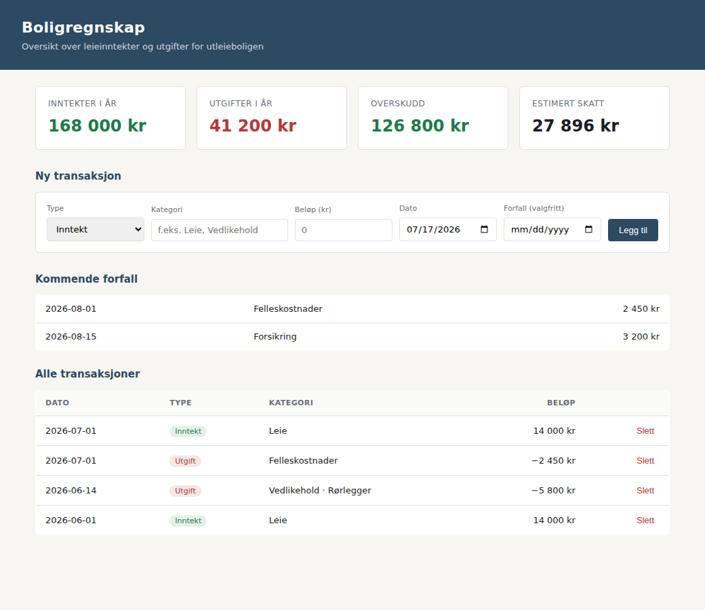

# Boligregnskap

Fullstack-app for å holde styr på økonomien i utleieboliger: leieinntekter, utgifter, forfallsdatoer, årsrapport med skatteestimat, og et automatisk anslag på hva en adresse burde kunne leies ut for. Bygget for å håndtere regnskapet for mine egne utleieboliger.



## Kort om oppsettet

| | |
|---|---|
| Backend | Java 21, Spring Boot 3, 13 klasser, ca. 800 linjer |
| Frontend | HTML, CSS og vanilla JavaScript, ingen rammeverk |
| Eksterne API-er | 2, begge offentlige og uten nøkkel |
| Database | H2, filbasert |
| Kostnad å drifte | 0 kr |

## Teknologi

Spring Web og Spring Data JPA mot en filbasert H2-database. REST-API mot en frontend uten byggesteg. Kartverkets adresse-API for geokoding og SSBs PxWebApi for leiemarkedsstatistikk.

## Funksjonalitet

* Flere eiendommer, hver med boligtype, areal, rom og byggeår.
* Inntekter og utgifter per eiendom, med kategorier som leie, felleskostnader, vedlikehold og forsikring.
* Oversikt over kommende forfall.
* Årsrapport med sum inntekter, sum utgifter, overskudd og skatteestimat.
* Estimert netto leieinntekt for en adresse, basert på SSBs leiemarkedsstatistikk for området.

## Bygging og testing

Claude Code skrev mesteparten av koden. Jeg styrte, og jeg kontrollerte.

Her hadde jeg en fordel de andre prosjektene mine ikke gir meg: dette er mitt eget regnskap. Tallene appen produserer er tall jeg kan fasiten på, så et feil skatteestimat eller et urimelig leieanslag ville vært åpenbart for meg med en gang. Det er en grundigere test enn noe jeg kunne skrevet.

Skattekonvensjonen ligger samlet i `SkatteUtil` av en grunn. Den ble først regnet ut to steder, og de to stedene rakk å bli uenige før jeg oppdaget det.

## Hvorfor løsningen ser slik ut

**Filbasert H2 framfor PostgreSQL.** Én bruker og ett datasett. En databaseserver ville lagt til drift uten å løse noe.

**Vanilla JavaScript framfor React.** Frontend er én side med et skjema og noen tabeller. Et rammeverk ville betydd byggesteg og avhengigheter for noe som fungerer uten.

**Kartverket og SSB framfor betalte tjenester.** Begge er offentlige, gratis og krever ingen nøkkel. Leieanslaget blir mindre presist enn en kommersiell takst, men det er godt nok til å svare på om leien ligger omtrent riktig.

**Egen migrasjonsrutine.** Da støtte for flere eiendommer kom til, måtte gamle transaksjoner uten eiendom kobles til en. `EiendomMigrationRunner` gjør det én gang ved oppstart, i stedet for at koden må håndtere transaksjoner uten eier for alltid.

## Kjøre det

Krever Java 21 og Maven.

```bash
mvn spring-boot:run
```

Appen ligger på `http://localhost:8080`.
